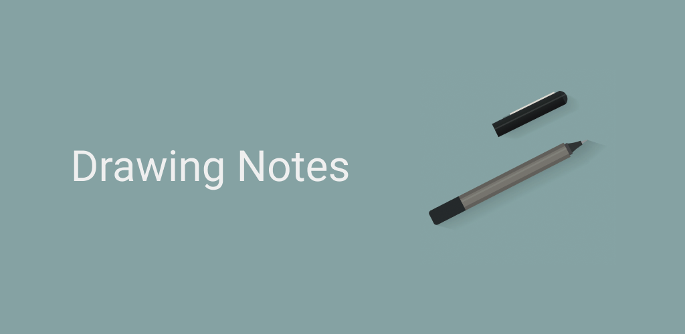
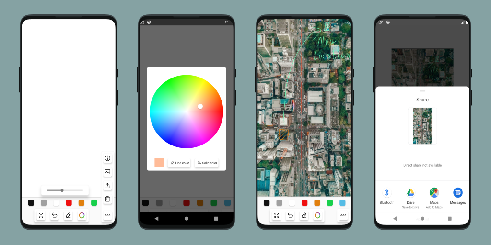

# Drawing Notes

 

_ _ _ 

***Last release version is 1.0.7 (19.01.22)***

## Introductions
Drawing Notes provides basic and essentual features for working with drafts and graphic notes.  Make easier to explain issues with finished sketch. Add notes to the image and share them. 
The Project is based on **MVP architecture** with Dagger2 for dependency injection.

## Previews

_ _ _
 

## Technology Stack
- **Kotlin**
- **Jetpack**
	- Lifecycle
- **Dagger2**
- **Firebase**
	 - Performance Monitoring
	 - Crashlytics 
	 - Analytics
- **Admob**
- **Google Play's billing system**
- [**MultiTouchGestureDetector**](https://github.com/dinuscxj/MultiTouchGestureDetector)
- [**ColorPickerPreference**](https://github.com/skydoves/ColorPickerPreference)
- Glide
_ _ _
 
